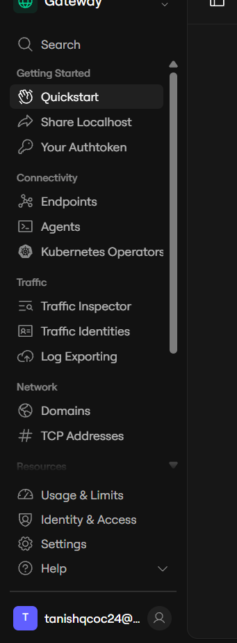
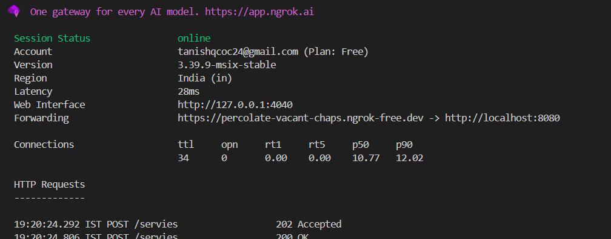
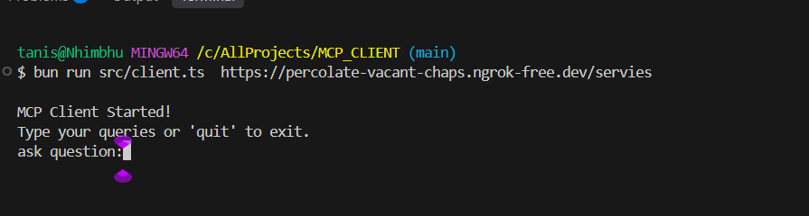

# Tanishq MCP Server

A personal **Model Context Protocol (MCP) server** built with **Bun + TypeScript**, paired with a **Groq-powered MCP client**. The server exposes resources, prompts, and tools that an LLM can call — and it can run either **locally** (stdio) or **remotely** over HTTP (tunneled with ngrok) so any MCP client, anywhere, can talk to it.

---

## ✨ Features

**Resources**

- `profile://tanishq` — professional profile / resume-style data
- `car://details` — sample structured personal data

**Prompts**

- `send_email_prompt` — drafts an email from `to`, `subject`, and `body`
- `vacation_planning` — builds a trip itinerary from duration, destination, interests, and budget

**Tools**

- `enrolled_students` — returns a list of enrolled students
- `weather_check` — returns the current weather for a given city
- `web_search` — placeholder for real-time web search

**Client**

- A CLI chat client (`client.ts`) that connects to the server, pulls in its resources/tools, and uses **Groq** (`openai/gpt-oss-120b`) to decide when to call them — powered by the `Client` and transports from `@modelcontextprotocol/sdk`.

---

## 📁 Project Structure

```
MCP_SERVER/
├── src/
│   ├── server.ts       # Local MCP server (stdio transport)
│   └── remoteMCP.ts     # Remote MCP server (HTTP transport via Hono, port 8080)

MCP_CLIENT/
└── src/
    └── client.ts         # MCP client (chat loop, powered by Groq)
```

> The server and client live in separate projects/repos — run them from their own folders as shown below.

---

## ✅ Prerequisites

- [Bun](https://bun.sh) installed
- A [Groq API key](https://console.groq.com/keys) (used by the client)
- [ngrok](https://ngrok.com) account (only needed for **remote** mode)

---

## 📦 Installation

Run this inside **both** the server project and the client project:

```bash
bun i
```

For the client, set your Groq API key as an environment variable before running it:

```bash
export GROQ_API_KEY=your_api_key_here      # macOS/Linux
setx GROQ_API_KEY "your_api_key_here"      # Windows
```

---

## 🚀 Usage

There are two ways to run this: **Local** (everything on one machine, no internet tunnel) or **Remote** (server exposed to the internet via ngrok, so the client can connect from anywhere).

### Option A — Local Mode (stdio)

The client spawns the server itself over stdio — one command does it all.

```bash
bun run src/client.ts src/server.ts
```

You'll see:

```
MCP Client Started!
Type your queries or 'quit' to exit.
ask question:
```

Start chatting — the client will call the server's tools/resources as needed.

---

### Option B — Remote Mode (HTTP + ngrok)

Use this when the client and server are on different machines, or you just want a shareable public URL for your server.

**Step 1 — Start the remote server**

In your server project folder:

```bash
bun run src/remoteMCP.ts
```

You should see:

```
Server is running on localhost:8080
```

**Step 2 — Install and set up ngrok**

1. Go to [ngrok.com](https://ngrok.com) and sign up.
2. Download and run the **Windows installer** (MSI) for ngrok.
3. Open the ngrok dashboard → **Getting Started → Quickstart**, and copy your **authtoken**.



**Step 3 — Open a new terminal and start the tunnel**

```bash
ngrok config add-authtoken YOUR_AUTHTOKEN
ngrok http 8080
```

(`8080` because that's the port `remoteMCP.ts` runs on.)

ngrok will print a session status screen with a **Forwarding** URL:



Copy that forwarding URL and append the server's route path (`/servies`) to it, e.g.:

```
https://percolate-vacant-chaps.ngrok-free.dev/servies
```

This URL is now a live tunnel: **client ⇄ ngrok ⇄ your local server**.

**Step 4 — Start the client, pointing it at the tunnel URL**

In a third terminal, from your client project folder:

```bash
bun run src/client.ts https://percolate-vacant-chaps.ngrok-free.dev/servies
```

You should see the chat client come up, ready for questions:



---

## 🧠 How It Works

```
 ┌────────────┐        ┌────────────┐        ┌──────────────────┐
 │ MCP Client │  --->  │   ngrok    │  --->  │  MCP Server        │
 │ (Groq LLM) │ <---   │  tunnel    │ <---   │  (Hono, port 8080) │
 └────────────┘        └────────────┘        └──────────────────┘
```

- **Local mode**: the client launches the server as a subprocess and talks to it over stdio — no network involved.
- **Remote mode**: the server runs standalone on `localhost:8080`; ngrok exposes it publicly for up to a few hours on the free plan, and the client connects over HTTP through that public URL.

In both cases, the client asks the server what resources/tools are available, hands that list to Groq, and lets the model decide when to call them mid-conversation.

---

## 🛠️ Tech Stack

- [Bun](https://bun.sh) — runtime & package manager
- TypeScript
- [`@modelcontextprotocol/sdk`](https://github.com/modelcontextprotocol) — MCP server & client
- [Hono](https://hono.dev) — HTTP server framework (remote mode)
- [Groq SDK](https://groq.com) — LLM inference for the client
- [Zod](https://zod.dev) — schema validation for tool/prompt inputs
- [ngrok](https://ngrok.com) — temporary public HTTPS tunnel

---

## ⚠️ Known Limitations

- `client.ts` currently always connects using the **remote** transport type, even when you pass a local `.ts` script path — so Option A (local mode) needs that hardcoded value updated if it stops working for you.
- The ngrok free plan tunnel is temporary (a few hours) — restart it and update the URL you pass to the client when it expires.

---

## 📄 License

Add your preferred license here (e.g. MIT).
